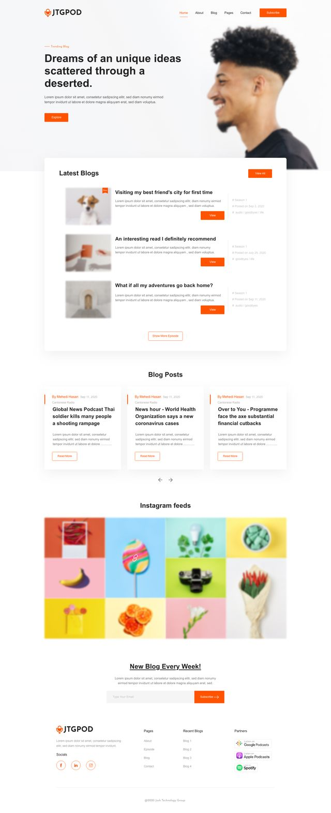

# Landing Page Assignment

A responsive and modern blog landing page designed as part of a web development assignment. The webpage features a navigation bar, introductory section, blog highlights, Instagram feed, and a subscription form. This project showcases clean design practices and attention to detail in UI/UX.

## Features

- **Navigation Bar**: Includes sections like Home, About, Blog, Pages, and Contact, along with a "Subscribe" button.
- **Introductory Section**: A visually appealing hero section with background images and engaging text to highlight trending blogs.
- **Latest Blogs Section**: Showcases recent blog posts with thumbnail images, titles, descriptions, and category tags.
- **Instagram Feed**: Displays a grid of images sourced from Instagram for visual engagement.
- **Weekly Blog Updates**: A subscription section for users to sign up for weekly blog updates.
- **Footer**: Contains social media links, pages, recent blogs, and partner logos.

## Technologies Used

- **HTML5**: For semantic structure and layout.
- **CSS3**: For styling and responsive design, including flexbox and grid layout.
- **Images**: Used for blog thumbnails, Instagram feed, and decorative elements.

## How to Run

1. Clone the repository:
   ```bash
   git clone https://github.com/your-username/blog-landing-page.git

2. Navigate to the project folder:
   ```bash
   cd blog-landing-page

3. Open `index.html` in your browser to view the webpage.

## Project Structure

1. `index.html`: Contains the main HTML structure for the landing page.
2. `styles.css`: Styles for the general layout, including navigation bar, hero section, and footer.
3. `latest_blog.css`: Styles specifically for the "Latest Blogs" section.
4. `assets/images/`: Directory containing images used across the webpage.

## Preview



## License
This project is licensed under the MIT License.


